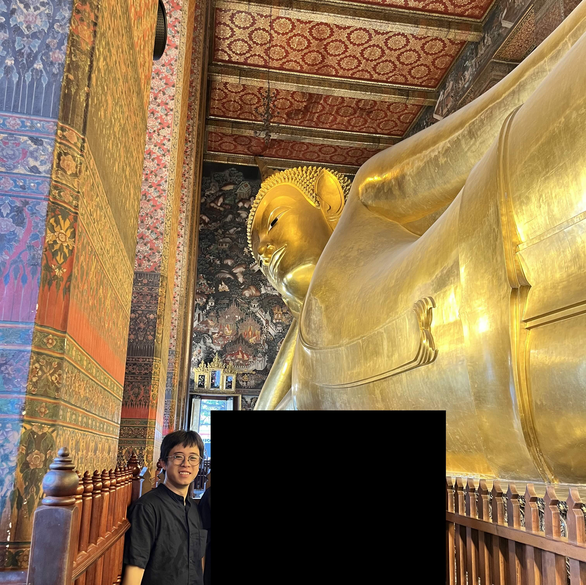

2023-05-29
Sân bay Suvarnabhumi
***
Bằng một cách nào đó thì tôi vẫn luôn biết rằng ngày này sẽ tới, với cái kiểu dửng dưng thờ ơ với giờ bay và nghĩ rằng mọi chuyện rồi sẽ ổn. Lần này thì hoàn cảnh có thay đổi đáng kể so với những gì tôi thường đặt mình vào trước mỗi chuyến bay: Tôi không ở đất nước của mình. Tuy nhiên, cái sự bàng quan thì vẫn như vậy. Kết quả là đây" Tôi ngồi một mình ở sân bay quốc tế viết những dòng chữ này, vật vã chờ đợi tới 4 rưỡi sáng mai để có thể check-in cho chuyến bay lúc 7h45 để được về với Hà Nội yêu dấu của tôi. 

Giờ tới phần ngữ cảnh cho tình huống đáng đời. 

Một cách ngắn gọn: Tôi bị lỡ chuyến bay

Một cách dài dòng, thì nó như thế này:

Hôm qua Thailand Kendo Club có tổ chức kỳ thi lên cấp cho người tập kendo. Tôi là một trong những người tham dự và đã bay sang từ tối thứ 7. Lần này câu lạc bộ nơi tôi tập luyện có nhiều người cũng cùng tham dự nên mọi người hẹn hò nhau để đi cùng cho vui, cũng là để chia sẻ kinh nghiệm và giúp đỡ nhau trong quá trình ở nước ngoài. Vé máy bay được đặt trước từ rất sớm, cách ngày bay khoảng 2 tháng, cho cả đoàn, và tất nhiên là... trừ tôi.

Tại sao lại thế? 

Với cái thái độ dửng dưng với việc bay lượn và thường không tính trước về tiền vé thì tôi đã không chốt việc đi thi cùng với mọi người sớm, mà phải chờ cho tới rất lâu sau mới đưa ra quyết định. Để bào chữa lại cho tôi một chút thì một phần lý do cũng là bởi tôi cũng lo sẽ vướng mất lịch thi. Nếu mà đang ở Thái Lan đúng vào hôm thi vấn đáp thì có lẽ là tôi có khấn hết mấy trăm mấy ngàn cái chùa và các ông thần ở đất nước này cũng không cứu được, cho dù các ông thần này có to đến mấy đi chăng nữa. *To như thế này cũng không cứu được (em không dám để lộ mặt các senpai ở cái bài viết ngớ ngẩn này, các anh chẳng may xem tới cũng mong lượng thứ cho em ạ)*

Nhưng cuối cùng thì tôi cũng sắp xếp được, chỉ cần phải hoãn thi một một thi viết 2 tín chỉ (lúc tôi viết những dòng này ở sân bay thì môn này là "không khó lắm", nhưng sau đi thi bù thì toát hết cả mồ hôi, may mà có đồng đội thi lại cùng cứu vớt), và tất nhiên là cuối cùng thì tôi cũng mua vé máy bay, chỉ có điều chuyến bay khác với mọi người: Tới muộn hơn và về sớm hơn.

Do đây là lần đầu tiên ra nước ngoài, không thể nào tránh được sự bỡ ngỡ, công thêm với cái sự lười biếng chuẩn bị nên tôi đã phải nhận hậu quả ngay từ khi đi từ sân bay tới chỗ ở tại Thái Lan: Tôi đặt xe về nhầm địa chỉ. Bác lái xe cho tôi đã có linh cảm không lành khi mà đỗ trong mấy cái ngõ ngoằn ngoèo tối tăm chó sủa inh ỏi. Bác rất tốt bụng đứng chờ với tôi lâu. Khổ nỗi bác không nói được tiếng Anh và tôi cũng cứ cam đoan với bác là "oke rồi anh" nên là bác cũng đi về thôi. Cũng may là tôi bị lạc ra không xa lắm nên chỉ phải vác chục cân hành lý với quần áo trên lưng đi bộ mất 20 phút thôi. Mồ hôi nhễ nhại tí nhưng không nhằm nhò gì. 

Về kì thi của tôi thì một cách ngắn gọn là suôn sẻ. Tôi cũng đã có một bài viết riêng cho nó tại [đây](https://longieee.web.app/kendo/nhat-ky-kendo-2023-06-03/).

Quay trở lại chuyện tôi ngồi đây viết bài giết thời gian. Do ở cùng nơi với mọi người nên cố nhiên việc ăn uống đi chơi xả hơi sau kỳ thi cũng là cùng nhau, cùng nhau cho tới khi bay về. Bởi vì chuyến bay của tôi khởi hành sớm hơn mọi người nên việc di chuyển của tôi cũng cần phải được bắt đầu sớm hơn, nhưng tôi thì lại vẫn theo lịch trình của mọi người. Đối với một chuyến bay quốc tế thì việc đến sớm hơn giờ bay một tiếng rưỡi của tôi cũng coi như là muộn.

Đau đớn hơn ở chỗ, thường thì các các chuyến bay đều sẽ có "last call" cho những người sắp lỡ, và mọi thủ tục sẽ được đẩy nhanh cho họ. Có lẽ last call cho chuyến bay của tôi đã hết trước cả lúc tôi vào xếp hàng check in. 

***

Cứu vớt được cho cái lòng tự trọng của tôi một chút là khi mà biết mình bị lỡ chuyến bay thì tôi đã không hoảng loạn. Sau khi hỏi hết tất cả những người có thể hỏi và biết rằng không thể làm gì được nữa thì tôi chấp nhận đó đơn giản là một hậu quả do sơ suất của chính mình. Giờ đây nó chỉ đơn giản là một vấn đề cần được giải quyết.

Chuyến bay thẳng về Nội bài sớm nhất là 7h45 sáng mai, và giờ tôi chỉ còn có thể đợi ở đây.

Tất nhiên là tôi chỉ có thể đổ lỗi cho tôi, cho cái sự lười nhác không chuẩn bị kĩ cho chuyến đi xa, và là chuyến ra nước ngoài đầu tiên nữa, tới một đất nước mới tràn ngập những con người mới, văn hoá mới, hành xử mới, thủ tục mới. Tôi chỉ có thể đổ lỗi cho cái thái độ dửng dưng dựa dẫm vào lịch trình của đoàn và coi thường thời gian, đánh giá thấp rủi ro. 

Nghĩ lại theo một hướng tích cực thì đây cũng là một trải nghiệm, cho dù cái giá để có được nó là đắt: Một triệu tám trăm ngàn đồng, thời gian chờ đợi, thêm một ngày nghỉ phép. Nhưng liệu rằng cái giá kia tôi liệt kê ra có đáng với những gì mà mình nhận được hay không? Có thể rút ra được điều gì tích cực và có ý nghĩa hay không, sau bao nhiêu là phiền toái?

Chừng đó tiền bạc và thời gian cho một bài học nhớ đời có lẽ cũng không quá đắt đỏ. Một cái tát đau, một gáo nước lạnh, đúng vậy, nhưng từ giờ thì tôi chừa rồi.

Hơn nữa thì gần đây thật hiếm khi nào tôi bắt buộc phải ngồi lại một mình, với suy nghĩ của mình, không chạy trốn đi đâu được. Chuyến bay tiếp theo trở về quá gần để tôi có thể rời sân bay và khám phá Thái Lan thêm một chút. Tôi không đem theo laptop để giết thời gian bằng một đống các khóa học còn dang dở. Màn hình điện thoại thì quá bé để tôi có thể nhìn vào lâu được, cộng thêm cái airpod làm tôi đau tai nữa. Nhờ vậy mà giờ đây tôi có thể ngồi đây, quan sát, viết, và suy nghĩ.

Viết ra hơn một nghìn chữ rồi thì bỗng dưng chuyến bay ngày mai cũng không xa như mình nghĩ, thời gian chờ đợi cũng không dài tới vậy, đống đồ phải vác trên lưng cũng không quá nặng nữa (nhưng vẫn làm tôi đau vai.) Điều duy nhất tiêu cực còn lại là sân bay lạnh quá! Và... không bán thuốc lá. Có lẽ tôi đã có thể suy nghĩ sâu hơn, viết hay hơn, nhưng ở đây văn minh quá, đành chịu vậy.

Suy cho cùng thì dù sao tôi cũng đã có được một bài học nhớ đời và một câu chuyện nho nhỏ ghi lại một kỉ niệm hay hay. Dù nó là tích cực hay tiêu cực thì nó cũng sắp hết rồi, và tôi lại hướng tới ngày mai. 

Giờ thì sắp xếp lại cái chỗ ghế này để chợp mắt một chút thôi!